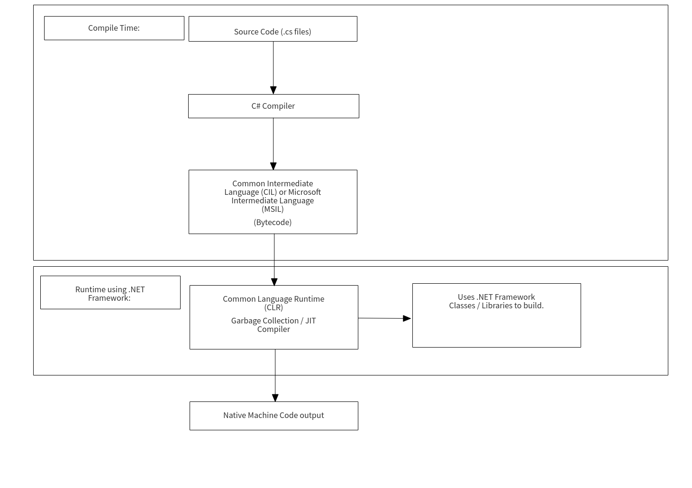

# Week 1 Day 1

## C#


### Course Overview

* Week 1:

* Fundamentals + OOP: Day 1
* ASP.NET Core: Day 2 - Day 3
* ASP.Net Core Intermediate: Day 4 - Day 5

* Week 2:

* Dapper: Day 6
* Entity Framework: Day 7
* Belt Prep: Day 8
* Deployment: Day 9
* Security + Identity: Day 10

* Week 3:

* Scalability: Day 11
* Catch up: Day 12
* Catch up: Day 13
* Catch up: Day 14
* BELT EXAM: Day 15 - Mandatory, else no retakes.

* Week 4:

* Retake 1: Day 16 - Monday
* Catch up + Personal Projects: Day 17
* Retake 2: Day 18 - Wednesday
* Catch up + Personal Projects: Day 19
* Retake 3 / Graduation: Day 20 - Friday

### C# Intro

* Created by Microsoft in 2002.
* Orignally codenamed "Cool" (C-like Object Oriented Language)
* Compiled language
* Object Oriented
* Built on .NET Framework (A programming API that runs and compiles applications.)
* Cross-Platform (Runs on Mac / Linux / Unix / Windows)

### Compiled vs Interpreted:

### Compiled - Pros:
* Speed
* Type Checking
* Verbose Errors

### Compiled - Cons:
* Compile Time
* Strict Syntax

### Interpreted - Pros:
* Portability
* Easy to read

### Interpreted - Cons:
* Slower performance

### Program LifeCycle:



### First Application
```cs
	using System;

	namespace hello_world{
		class Program{
			static void Main(string[] args){
				Console.WriteLine("Hello World!");
			}
		}
	}
```

### Namespaces

Namespaces allow developers to package all of their code into a library of related classes. Think of the Math library in javascript, where each method within the library pertains to something math related. In short, it offers us a way to organize our source code in a way that makes sense to us.

<details>
<summary><strong>What are Classes and why should we use them?</strong></summary>    
Classes allow us to create blueprints for objects
that we can instantiate and perform actions on. This allows us to create multiple instances of objects, each with their own actions and attributes. Without classes, we would need to re-write massive portions of our code each time we wanted to perform such tasks.

Every <code>.cs</code> file we create, must contain a class
</details>

<details>
<summary><strong>Where does a C# program begin execution?</strong></summary>    
In the Main() method! Every C# program must have one as this is the entry point in which our programs will be run! This is the first part of our program that will be executed.
</details>

### Data Types:

Data types tell us what a piece of data can and does contain. They exist not only to organize what data we're storing in our variables, but they allocate a specific amount of space in RAM, as opposed to non statically-typed languages. This specific allocation of RAM speeds up runtime of our program.

Here are a few:

* int - Stores integers
* long - Stores large integers.
* string - Stores an array of characters such as a word.
* bool - Stores a true or false value, like determining if a lightswitch is on or off.
* double - Stores precise decimal values, such as 4.99
* char - Stores a single character, such as the letter 'A' if you we're writing a program to grade papers.

Here's an example of creating a variable of type "int":

```cs
	int myNumber = 1337;
```

### Conditionals:

Conditionals such as if statements let us execute portions of code when an expression returns true.

```cs
	int myNumber = 1337;
	int pi = 3.14;

	if(myNumber > pi){
		Console.WriteLine("I guess you must prefer cake, thats unfortunate.");
	}else{
		Console.WriteLine("You like pie too? Lets be pals.");
	}
```

### For Loops:

Loops let us repeat portions of our code without having to re-write it ourselves. How convenient!

Heres a C# for loop:

```cs
	for(int i=0; i < 10; i++){
		Console.WriteLine(i);
	}
```

### Random Values:

Random Number Generators give developers the ability to estimate random chance such as a coin toss.

Heres an example of how to instantiate a random object:

```cs
	Random rand = new Random(); // Instantiate a random number generator.

	int num = rand.Next(5,10); // Generate a random number between 5-10, storing it in "num".
```

### Arrays:

Arrays let us store multiple values in one place, dynamically allocating space in memory for each element. Standard arrays cannot grow or shrink in size, however, the values of each element can be changed.

```cs
	string[] words = {
		"Hello",
		"there",
		"everyone."
	};

	words[0] = "Goodbye";
```

### Lists:

Lists are like Arrays, except that they can grow and shrink in size, allowing for more flexibility.

```cs
	using System.Collections.Generic;

	List<string> products = new List<string>{
		"soap",
		"batteries",
		"wallet"
	};

	products.Add("detergent");

	products.RemoveAt(2);

	products.Remove("soap");
```

### Dictionaries:

Dictionaries store key / value pairs. They are not numerically indexed like arrays.

```cs
	using System.Collections.Generic;

	Dictionary<string,string> person = new Dictionary<string,string>();
	person.Add("name","Tony");
	person.Add("location","Tyson's Dojo");
	person.Add("stack","C#");
```

### Functions:

Functions let us name blocks of our code that we can execute as many times as we desire.

```cs
	using System.Collections.Generic;

	int add(int a,int b){
		return a+b;
	}

	int subtract(int a,int b){
		return a-b;
	}

	int a = add(10,20);
	int b = subtract(a,10);
	int c = add(b,5);
```

### Group Whiteboard:

* Create and name a variable for each of the above types.

* Write a conditional to determine if your "long" variable is larger than your "int" variable. If so, log the word "Hello", else log the word "World".

* Write a for loop, looping thru the <code>.Length</code> of your string, determining whether your string contains the character in your "char" variable. If so, set your boolean to true, else set your boolean to false.

* Create a random object and generate a number between 10 and 20, storing it in your int variable. If the number is less than 10, log "Heads", else log "Tails".

* Create an array of strings that contains the names of your group members.

* Create a List that contains strings. Loop your string array and <code>.Add()</code> each of your group members to it. <code>.RemoveAt()</code> the second group member from your List.

* Create a dictionary with the following keys pertaining to one of your group member's info: "name","favoriteMovie","favoriteGenre" and "favoriteLanguage".

* Create a function "loop" that iterates your dictionary, printing each key and value.

