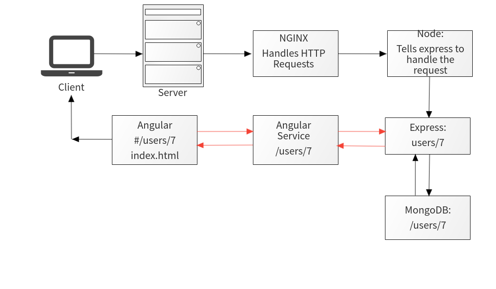

# Week 1 Day 1

## JavaScript

### Stack Overview:

* JavaScript: Day 1 - Day 3
* Node: Day 3
* Express + Sockets: Day 4 - Day 5
* Mongo + Mongoose: Day 6 - Day 8
* Angular: Day 9 - Day 12
* Full MEAN: Day 13 - Project Week

### MEAN Request + Response Cycle

* 

	
What does MEAN stand for?

	* MongoDB
	* Express
	* Angular
	* NodeJS

* 

	
What programming language's will we be writing in during MEAN

	* JavaScript
	* Okay okay, HTML and CSS are valid too..

* 

	
Do we need to use these 4 technologies? What about NodeJS?

	Not necessarily. The benefit of using NodeJS is its modularity. We can swap technologies in and out to suit or needs. What if we wanted to use MySQL as our main source of storing information because we needed relational-based data storage? Are we allowed to do that? You betcha. What about Angular? Why can't we use React as our front-end framework instead? You can! How about Node? Well then we should probably consider a different stack altogether if thats the case. Node is our JavaScript interpreter, without it, we wouldn't be able to compile our code or run our server!

### JavaScript:

* 

	
What is JavaScript?

	JavaScript is primarily a client-side scripting language. This is not true anymore though! JavaScript normally runs in our web browser, used for manipulating the DOM, so we can programatically alter our HTML and CSS as well as the logic of our application. With NodeJS, we can now do all of this without even touching a web browser! NodeJS is a JavaScript interpreter that runs OUTSIDE of our browser as an actual application that interprets and compiles our JavaScript. Imagine all of the power JavaScript gives us, running right inside your terminal! Well, thats exactly what it will do for us. We will be using it to host and run our WebServer!

	JavaScript is event-driven. This means there is always some infinite while or for loop running in the background that is keeping things updated, so that when things change, it knows how to react to it! This is a key difference that makes JS extremely reliable. 

	For example, consider the older but still popular language PHP. Imagine we call up our old friend and tell him we are expecting a package to be delivered at some point today and he needs to sign for it. PHP says sure, no problem as he sits on your front porch waiting for it to arrive the entire day. Nothing else, just sitting on your porch. Staring... The package arrives and PHP signs for it.

	Thats fine and all but lets call our friend JavaScript instead, because we know he/she will be more productive with their time. We call JavaScript and tell them the same thing. JavaScript says sure, not a problem! JavaScript then goes on to do daily errands such as vacuuming, doing dishes, getting groceries and maybe also catches up on some sleep. The doorbell rings and JavaScript signs for your package. 

	JavaScript got a lot more done today than PHP didnt it? Thats the power of JavaScript and it's event loop. 

* 

	
Where is client-side JavaScript Interpreted?

	Client-side JavaScript is the JavaScript that runs in our browser. So it runs on our computer! Its the same JavaScript you have been running all along, such as in Web Fundamentals when using jQuery. If its server-side JavaScript, someone else's server or computer is executing that code, most likely using Node as their back-end to host things like web pages,JSON data or whatever they decide really. 	

### JavaScript Benefits:

* Popular - Most popular language in the web world, lots of support, great for prototyping.

* Functionality - We can do anything in JavaScript that we can in any other language.

* Stack Driven - Whether you like JS or not running as our back-end, you'll still end up using it on the client-side at some point.

### ES6:

* 

	
What is ES6?

	ES6 stands for EcmaScript 6. It was built to standardize JavaScript and allow for different implementations and versions of JavaScript. You can think of it as a pre-cursor that JavaScript it built on top of. Version 6, which is the latest implemented a plethora of new features that we're made available to us. Some of them are listed below.

	Its also a wrapper for ES5 functionality. In other words, the new features in ES6 are written in ES5, so knowing how ES5 works first is important.

### ES6 Benefits:

* Classes.

* Arrow functions.

* Block scoped variables and constants.

* Default function parameters.

* Many more.

### Code:

* 

	
How can we run it in our browser?

	The quickest way is to make an <code>.html</code> file, and create a <code></code> tag, with our code in between.

	Ex:

	<code>
		<!DOCTYPE html>
		<html>
		<head>
			<title></title>
		</head>
		<body>
			
		</body>
		</html>
	</code>

* 

	
What are three ways we can define variables in JavaScript?

	* var:

	<code>
		var myVariable = 1337;
	</code>

	* let:

	<code>
		let myVariable = 1337;
	</code>

	* const:

	<code>
		const myVariable = 1337;
	</code>

* 

	
What is the difference between these 3 definitions?

	var -  defines a variable just like you have seen all along. However, this defines the variable in global space, meaning that it exists everywhere in our application and even other JavaSCript files that need to access it.

	Ex:

	<code>
		console.log(myVar);

		if(123 == 123){
			var myVar = 456;
		}

		// We can access "myVar" before it even exists within this if statement, due to the way JavaScript hoists data.
	</code>

	let - defines a variable the same way as var, except that variable only exists within the block of code it was defined in such as a function, if/else block, try/catch or loop. This prevents our data from leaking all over our application, preventing global namespace pollution. We don't want our data or sensitive information to be available in every part of our application do we? Use let when you know that a variable shouldn't be accessable outside of the location its defined in.

	<code>
		console.log(myVar);

		if(123 == 123){
			let myVar = 456;
			// Using the variable within its scope:
			console.log(myVar);
		}

		// myVar doesn't exist outside of the if statement, so we get undefined.
		// if we want to use this variable, we must do so within the if statement.		
	</code>

	const - Also a variable definition, except once you set its value, it can never change. If we attempt to change its value, we will get an access violation telling us "Hey, you told us this shouldn't change, stop trying to change it!". Consts are useful when you know that some data shouldn't change, such as PI. PI never changes, so we might consider making it a constant value.

	<code>
		const PI = 3.14159;

		// Attempting to redefine a constant variable will throw an error at us. We told it to never change, but good luck trying!
		PI = 456;
	</code>

* 

	
How do we define strings?

	Create a variable and surround its value with double or single quotes.

	<code>
		var myString = "Hello!";
		var myOtherString = 'Goodbye!'
	</code>

* 

	
How do we instantiate loops?

	Use the word for, followed by a variable to initialize a counter, the conditional it should break at, and a number to increment by:

	<code>
		for(let i=0; i < 10; i++){
			console.log(i);
		}
	</code>

* 

	
How do we write conditionals?

	Use the word if, followed by two values we are comparing:

	<code>
		if( 5 > 10 ){
			console.log("Well thats not right.");
		}else if( 13 < 7 ){
			console.log("Well, neither is that.");
		}else{
			console.log("Phew, glad we made it here...");
		}
	</code>

* 

	
How about arrays?

	Define a variable, and enclose some data with a pair of square brackets. Values are separated by commas:

	<code>
		let myArr = [5,10,15];

		console.log( myArr[1] );
	</code>

* 

	
How do we create objects?

	Define a variable and enclose some data with a pair of curly braces. Values are key, value pair based. They are separated by a colon and multiple values are separated by commas:

	<code>
		let myObject = {
			"name":"Bob",
			"age":32,
			"job":"Accountant"
		};
	</code>

* 

	
How can we traverse objects? Can we use a normal for loop?

	No. Objects have keys and values, not numberical indices, so we must somehow state each key in order to retrieve each value.

	The "in" keyword retrieves the keys of the object that we are trying to traverse. This lets us iterate it's values:

	<code>
		let myObject = {
			"name":"Bob",
			"age":32,
			"job":"Accountant"
		};
		
		for( let someValue in myObject ){
			console.log( someValue );
		}
	</code>

